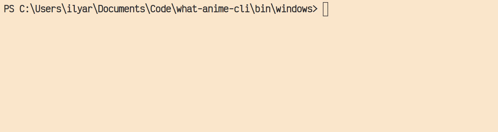

# What Anime CLI ❓🖼
<p align="center">> This application is basically a 🍬 wrapper around 
<a href="https://github.com/soruly/trace.moe">trace.moe </a></p>
<p align="center">PREVIEW</p>
<p align="center"></p>

# Usage 🖥
### Get Anime By Image File 🗃
```what-anime file anime.jpg```

### Get Anime By Image Link 🔗
```what-anime link https://anime.com/image.png``` <br>
<em>NOTE</em>: MAKE SURE THAT YOUR LINKS <b>ENDS WITH .IMAGE_FORMAT</b> AND DOESN'T HAVE ANY <b>&</b> CHARS AFTER BECAUSE THIS SYMBOL IS RESERVED BY GOLANG 

### Supported image extensions 🖼
I've tested these:
- jpg
- png
- jfif

If you have found other's working formats please create an issue

# Installation 🔨
Build from source or go to <a href="https://github.com/irevenko/what-anime-cli/tree/main/bin">bin</a> folder and pick your executable file

# Contributing 🤝
Contributions, issues and feature requests are welcome! 👍 <br>
Feel free to check [open issues](https://github.com/irevenko/what-anime-cli/issues).

# Quick Start 🚀
```git clone https://github.com/irevenko/what-anime-cli.git``` <br>
```cd what-anime-cli``` <br>
```go get -d ./...``` <br>
```go run main.go``` <br>

# What I Learned 🧠
- How to build CLI using Go
- Go project structure
- Go basics (modules, working with images, making HTTP requests)

# License 📑 
(c) 2021 Ilya Revenko. [MIT License](https://tldrlegal.com/license/mit-license)
